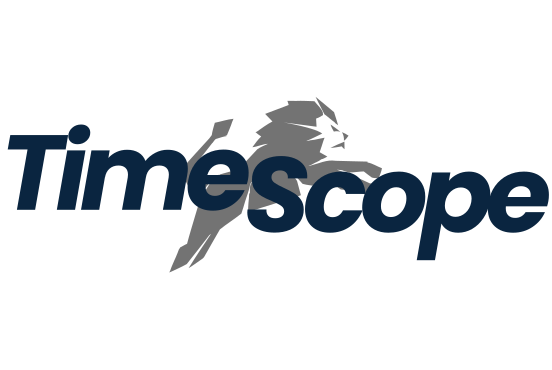

<a id="readme-top"></a>

<!-- PROJECT SHIELDS -->
[![Contributors][contributors-shield]][contributors-url]
[![Forks][forks-shield]][forks-url]
[![Stargazers][stars-shield]][stars-url]
[![Issues][issues-shield]][issues-url]
[![MIT License][license-shield]][license-url]

<!-- PROJECT LOGO -->
<br />
<div align="center">
  <a href="https://github.com/Endikk/TimeScope">
    
  </a>

  <h3 align="center">TimeScope</h3>

  <p align="center">
    Application de suivi du temps et de productivité pour équipes et entreprises.
    <br />
    <a href="https://github.com/Endikk/TimeScope"><strong>Explore the docs »</strong></a>
    <br />
    <br />
    <a href="https://github.com/Endikk/TimeScope/issues/new?labels=bug&template=bug-report---.md">Report Bug</a>
    ·
    <a href="https://github.com/Endikk/TimeScope/issues/new?labels=enhancement&template=feature-request---.md">Request Feature</a>
  </p>
</div>

<!-- TABLE OF CONTENTS -->
<details>
  <summary>Table of Contents</summary>
  <ol>
    <li>
      <a href="#about-the-project">À propos du projet</a>
      <ul>
        <li><a href="#built-with">Stack Technique</a></li>
      </ul>
    </li>
    <li>
      <a href="#getting-started">Démarrage</a>
      <ul>
        <li><a href="#prerequisites">Prérequis</a></li>
        <li><a href="#installation">Installation</a></li>
      </ul>
    </li>
    <li><a href="#usage">Utilisation</a></li>
    <li><a href="#roadmap">Roadmap</a></li>
    <li><a href="#contributing">Contribuer</a></li>
    <li><a href="#license">Licence</a></li>
    <li><a href="#contact">Contact</a></li>
    <li><a href="#acknowledgments">Remerciements</a></li>
  </ol>
</details>

<!-- ABOUT THE PROJECT -->
## About The Project

[![TimeScope Screenshot][product-screenshot]](https://github.com/Endikk/TimeScope)

TimeScope est une application web complète conçue pour le suivi du temps et l'analyse de la productivité. Elle permet aux équipes de consigner le temps passé sur diverses tâches et projets, offrant ainsi une vision claire de la répartition du travail et de l'efficacité.

Pourquoi TimeScope ?
* **Centralisation :** Regroupez le suivi du temps de tous vos projets en un seul endroit.
* **Automatisation :** Simplifiez la génération de rapports et le calcul des heures.
* **Technologie Moderne :** Construit avec une stack robuste et performante, prête pour le déploiement.

<p align="right">(<a href="#readme-top">back to top</a>)</p>

### Built With

TimeScope est construit avec les technologies suivantes :

* [![.NET][DotNet-shield]][DotNet-url]
* [![React][React.js]][React-url]
* [![TypeScript][TypeScript-shield]][TypeScript-url]
* [![PostgreSQL][PostgreSQL-shield]][PostgreSQL-url]
* [![Docker][Docker-shield]][Docker-url]
* [![Tailwind CSS][Tailwind-shield]][Tailwind-url]

<p align="right">(<a href="#readme-top">back to top</a>)</p>

<!-- GETTING STARTED -->
## Getting Started

Pour obtenir une copie locale du projet et la faire fonctionner, suivez ces étapes simples.

### Prerequisites

Assurez-vous d'avoir les outils suivants installés sur votre machine.

* **.NET SDK 8+**
  ```sh
  https://dotnet.microsoft.com/download
  ```
* **Node.js 18+**
  ```sh
  https://nodejs.org/
  ```
* **Docker**
  ```sh
  https://www.docker.com/products/docker-desktop/
  ```
* **Git**
  ```sh
  https://git-scm.com/downloads
  ```

### Installation

1. **Clonez le dépôt**
   ```sh
   git clone https://github.com/Endikk/TimeScope.git
   cd TimeScope
   ```

2. **Démarrez la base de données avec Docker**
   ```sh
   docker-compose up -d
   ```
   Cette commande démarre PostgreSQL sur le port 5432 et pgAdmin sur le port 5050.

3. **Configurez la chaîne de connexion**
   Vérifiez `TimeScope.API/appsettings.Development.json` et adaptez la `ConnectionStrings` si nécessaire.

4. **Appliquez les migrations et lancez l'API**
   ```sh
   # Depuis la racine du projet
   dotnet restore

   # Appliquez les migrations
   cd TimeScope.Infrastructure
   dotnet ef database update --startup-project ../TimeScope.API
   cd ..

   # Lancez l'API
   cd TimeScope.API
   dotnet run
   ```
   L'API sera accessible via Swagger à l'adresse `https://localhost:5001/swagger`.

5. **Démarrez le frontend**
   ```sh
   cd TimeScope.Frontend
   npm install
   npm run dev
   ```
   Le frontend sera disponible à l'adresse `http://localhost:5173`.

<p align="right">(<a href="#readme-top">back to top</a>)</p>

<!-- USAGE EXAMPLES -->
## Usage

Une fois l'application lancée, vous pouvez commencer à explorer ses fonctionnalités :
- **Gestion des utilisateurs :** Créez, modifiez et gérez les accès des utilisateurs.
- **Suivi du temps :** Enregistrez le temps passé sur des tâches spécifiques.
- **Rapports :** Générez des rapports détaillés par projet, utilisateur ou période.

_Pour plus d'exemples, veuillez vous référer à la [Documentation](https://github.com/Endikk/TimeScope)_

<p align="right">(<a href="#readme-top">back to top</a>)</p>

<!-- ROADMAP -->
## Roadmap

- [ ] **Phase 1: Performance and Stability**
    - [ ] Optimize backend data queries
    - [ ] Implement server-side filtering and pagination
    - [ ] Add unit and integration tests for backend and frontend
- [ ] **Phase 2: Feature Enhancements**
    - [ ] Develop user profile and settings management
    - [ ] Build an advanced reporting module
    - [ ] Create a notification system
- [ ] **Phase 3: Production Readiness**
    - [ ] Establish a CI/CD pipeline
    - [ ] Finalize production-ready Docker configurations
    - [ ] Enhance monitoring and logging

See the [open issues](https://github.com/Endikk/TimeScope/issues) for a full list of proposed features (and known issues).

<p align="right">(<a href="#readme-top">back to top</a>)</p>

<!-- CONTRIBUTING -->
## Contributing

Les contributions sont ce qui rend la communauté open source un endroit incroyable pour apprendre, inspirer et créer. Toutes vos contributions sont **grandement appréciées**.

Si vous avez une suggestion pour améliorer ce projet, veuillez forker le dépôt et créer une pull request. Vous pouvez aussi simplement ouvrir une issue avec le tag "enhancement".
N'oubliez pas de donner une étoile au projet ! Merci encore !

1. Fork the Project
2. Create your Feature Branch (`git checkout -b feature/AmazingFeature`)
3. Commit your Changes (`git commit -m 'Add some AmazingFeature'`)
4. Push to the Branch (`git push origin feature/AmazingFeature`)
5. Open a Pull Request

### Top contributors:
<a href="https://github.com/Endikk/TimeScope/graphs/contributors">
  
</a>

<p align="right">(<a href="#readme-top">back to top</a>)</p>

<!-- LICENSE -->
## License

Distribué sous la licence MIT. Voir `LICENSE.txt` pour plus d'informations.

<p align="right">(<a href="#readme-top">back to top</a>)</p>

<!-- CONTACT -->
## Contact

Endikk - [@Endikk](https://github.com/Endikk)

Project Link: [https://github.com/Endikk/TimeScope](https://github.com/Endikk/TimeScope)

<p align="right">(<a href="#readme-top">back to top</a>)</p>

<!-- ACKNOWLEDGMENTS -->
## Acknowledgments

Ressources utiles et remerciements :
* [Choose an Open Source License](https://choosealicense.com)
* [Img Shields](https://shields.io)
* [Font Awesome](https://fontawesome.com)
* [React Icons](https://react-icons.github.io/react-icons/search)

<p align="right">(<a href="#readme-top">back to top</a>)</p>

<!-- MARKDOWN LINKS & IMAGES -->
[contributors-shield]: https://img.shields.io/github/contributors/Endikk/TimeScope.svg?style=for-the-badge
[contributors-url]: https://github.com/Endikk/TimeScope/graphs/contributors
[forks-shield]: https://img.shields.io/github/forks/Endikk/TimeScope.svg?style=for-the-badge
[forks-url]: https://github.com/Endikk/TimeScope/network/members
[stars-shield]: https://img.shields.io/github/stars/Endikk/TimeScope.svg?style=for-the-badge
[stars-url]: https://github.com/Endikk/TimeScope/stargazers
[issues-shield]: https://img.shields.io/github/issues/Endikk/TimeScope.svg?style=for-the-badge
[issues-url]: https://github.com/Endikk/TimeScope/issues
[license-shield]: https://img.shields.io/github/license/Endikk/TimeScope.svg?style=for-the-badge
[license-url]: https://github.com/Endikk/TimeScope/blob/main/LICENSE
[product-screenshot]: TimeScope.Frontend/public/assets/images/device-mockup.png
[React.js]: https://img.shields.io/badge/React-20232A?style=for-the-badge&logo=react&logoColor=61DAFB
[React-url]: https://reactjs.org/
[DotNet-shield]: https://img.shields.io/badge/.NET-512BD4?style=for-the-badge&logo=dotnet&logoColor=white
[DotNet-url]: https://dotnet.microsoft.com/
[TypeScript-shield]: https://img.shields.io/badge/TypeScript-3178C6?style=for-the-badge&logo=typescript&logoColor=white
[TypeScript-url]: https://www.typescriptlang.org/
[PostgreSQL-shield]: https://img.shields.io/badge/PostgreSQL-4169E1?style=for-the-badge&logo=postgresql&logoColor=white
[PostgreSQL-url]: https://www.postgresql.org/
[Docker-shield]: https://img.shields.io/badge/Docker-2496ED?style=for-the-badge&logo=docker&logoColor=white
[Docker-url]: https://www.docker.com/
[Tailwind-shield]: https://img.shields.io/badge/Tailwind_CSS-38B2AC?style=for-the-badge&logo=tailwind-css&logoColor=white
[Tailwind-url]: https://tailwindcss.com/