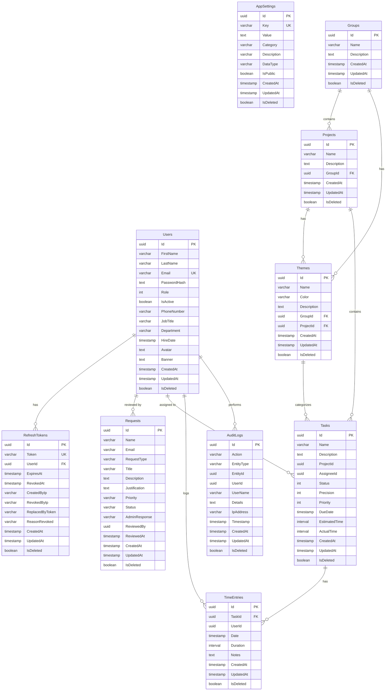
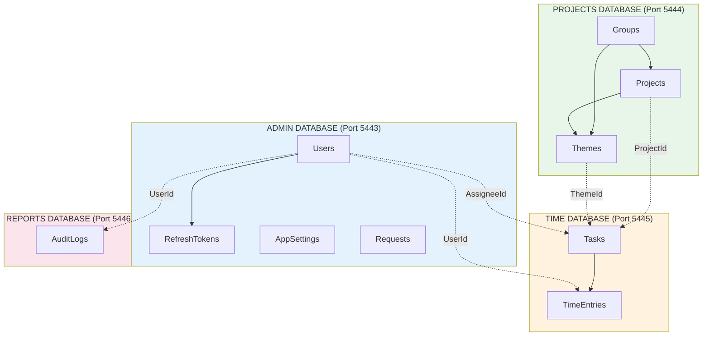

# Architecture des Bases de Données TimeScope

## Vue d'ensemble

TimeScope utilise une **architecture multi-bases de données** avec 4 bases PostgreSQL distinctes, chacune dédiée à un domaine fonctionnel spécifique. Cette conception suit le pattern Database-per-Bounded-Context du Domain-Driven Design.

---

## Configuration des connexions

| Base de données | Port | Nom | Compte de service |
|-----------------|------|-----|-------------------|
| Admin | 5443 | timescope_admin | svc_timescope_admin |
| Projects | 5444 | timescope_projects | svc_timescope_projects |
| Time | 5445 | timescope_time | svc_timescope_time |
| Reports | 5446 | timescope_reports | svc_timescope_reports |

---

## 1. BASE ADMIN (timescope_admin)

**Objectif** : Gestion des utilisateurs, authentification et paramètres applicatifs

**DbContext** : `AdminDbContext`
**Schéma** : `admin`

### Tables

#### admin.Users
Comptes utilisateurs avec authentification et informations professionnelles.

| Champ | Type | Contraintes | Description |
|-------|------|-------------|-------------|
| Id | GUID | PK | Identifiant unique |
| FirstName | VARCHAR(100) | Required | Prénom |
| LastName | VARCHAR(100) | Required | Nom |
| Email | VARCHAR(255) | Required, Unique | Email (login) |
| PasswordHash | TEXT | Required | Hash du mot de passe (BCrypt) |
| Role | INT | Required | Rôle (0=Admin, 1=Manager, 2=Employee) |
| IsActive | BOOLEAN | Required | Compte actif |
| PhoneNumber | VARCHAR(20) | - | Téléphone |
| JobTitle | VARCHAR(100) | - | Poste |
| Department | VARCHAR(100) | - | Département |
| HireDate | TIMESTAMP | - | Date d'embauche |
| Avatar | TEXT | - | Photo de profil (base64) |
| Banner | TEXT | - | Bannière de profil (base64) |
| CreatedAt | TIMESTAMP | Required | Date de création |
| UpdatedAt | TIMESTAMP | - | Dernière modification |
| IsDeleted | BOOLEAN | Required | Suppression logique |

**Index** : Email (Unique)

---

#### admin.AppSettings
Paramètres de configuration de l'application.

| Champ | Type | Contraintes | Description |
|-------|------|-------------|-------------|
| Id | GUID | PK | Identifiant unique |
| Key | VARCHAR(200) | Required, Unique | Clé du paramètre |
| Value | TEXT | Required | Valeur |
| Category | VARCHAR(100) | Required, Indexed | Catégorie |
| Description | VARCHAR(500) | - | Description |
| DataType | VARCHAR(50) | Required | Type (string, number, boolean, json) |
| IsPublic | BOOLEAN | Required | Accessible sans auth |
| CreatedAt | TIMESTAMP | Required | Date de création |
| UpdatedAt | TIMESTAMP | - | Dernière modification |
| IsDeleted | BOOLEAN | Required | Suppression logique |

**Index** : Key (Unique), Category

---

#### admin.RefreshTokens
Tokens JWT de rafraîchissement pour la gestion des sessions.

| Champ | Type | Contraintes | Description |
|-------|------|-------------|-------------|
| Id | GUID | PK | Identifiant unique |
| Token | VARCHAR(500) | Required, Unique | Token de rafraîchissement |
| UserId | GUID | Required, Indexed | Référence utilisateur |
| ExpiresAt | TIMESTAMP | Required, Indexed | Date d'expiration |
| RevokedAt | TIMESTAMP | - | Date de révocation |
| CreatedByIp | VARCHAR(45) | - | IP de création (IPv6) |
| RevokedByIp | VARCHAR(45) | - | IP de révocation |
| ReplacedByToken | VARCHAR(500) | - | Token de remplacement |
| ReasonRevoked | VARCHAR(200) | - | Raison de révocation |
| CreatedAt | TIMESTAMP | Required | Date de création |
| UpdatedAt | TIMESTAMP | - | Dernière modification |
| IsDeleted | BOOLEAN | Required | Suppression logique |

**Index** : Token (Unique), UserId, ExpiresAt

---

#### admin.Requests
Demandes utilisateurs et requêtes administratives.

| Champ | Type | Contraintes | Description |
|-------|------|-------------|-------------|
| Id | GUID | PK | Identifiant unique |
| Name | VARCHAR(200) | Required | Nom du demandeur |
| Email | VARCHAR(255) | Required, Indexed | Email du demandeur |
| RequestType | VARCHAR(50) | Required, Indexed | Type de demande |
| Title | VARCHAR(500) | Required | Titre |
| Description | TEXT | Required | Description |
| Justification | TEXT | Required | Justification |
| Priority | VARCHAR(20) | Required, Indexed | Priorité |
| Status | VARCHAR(50) | Required, Indexed | Statut |
| AdminResponse | VARCHAR(2000) | - | Réponse admin |
| ReviewedBy | GUID | - | Admin qui a traité |
| ReviewedAt | TIMESTAMP | - | Date de traitement |
| CreatedAt | TIMESTAMP | Required, Indexed | Date de création |
| UpdatedAt | TIMESTAMP | - | Dernière modification |
| IsDeleted | BOOLEAN | Required | Suppression logique |

**Index** : Email, Status, Priority, RequestType, CreatedAt

---

## 2. BASE PROJECTS (timescope_projects)

**Objectif** : Organisation des projets, groupements et thèmes

**DbContext** : `ProjectsDbContext`
**Schéma** : `projects`

### Tables

#### projects.Projects
Enregistrements des projets.

| Champ | Type | Contraintes | Description |
|-------|------|-------------|-------------|
| Id | GUID | PK | Identifiant unique |
| Name | VARCHAR(100) | Required | Nom du projet |
| Description | TEXT | - | Description |
| GroupId | GUID | FK -> Groups | Groupe parent |
| CreatedAt | TIMESTAMP | Required | Date de création |
| UpdatedAt | TIMESTAMP | - | Dernière modification |
| IsDeleted | BOOLEAN | Required | Suppression logique |

**Relations** :
- Many-to-One → Groups (SetNull on delete)
- One-to-Many → Themes
- One-to-Many → WorkTasks (cross-database)

---

#### projects.Groups
Groupements organisationnels pour les projets.

| Champ | Type | Contraintes | Description |
|-------|------|-------------|-------------|
| Id | GUID | PK | Identifiant unique |
| Name | VARCHAR(100) | Required | Nom du groupe |
| Description | TEXT | - | Description |
| CreatedAt | TIMESTAMP | Required | Date de création |
| UpdatedAt | TIMESTAMP | - | Dernière modification |
| IsDeleted | BOOLEAN | Required | Suppression logique |

**Relations** :
- One-to-Many → Projects
- One-to-Many → Themes

---

#### projects.Themes
Thèmes visuels pour catégoriser le travail.

| Champ | Type | Contraintes | Description |
|-------|------|-------------|-------------|
| Id | GUID | PK | Identifiant unique |
| Name | VARCHAR(100) | Required | Nom du thème |
| Color | VARCHAR(7) | Required | Couleur hex (#FFFFFF) |
| Description | TEXT | - | Description |
| GroupId | GUID | FK -> Groups | Groupe associé |
| ProjectId | GUID | FK -> Projects | Projet associé |
| CreatedAt | TIMESTAMP | Required | Date de création |
| UpdatedAt | TIMESTAMP | - | Dernière modification |
| IsDeleted | BOOLEAN | Required | Suppression logique |

**Relations** :
- Many-to-One → Groups (SetNull on delete)
- Many-to-One → Projects (SetNull on delete)
- One-to-Many → WorkTasks (cross-database)

---

## 3. BASE TIME (timescope_time)

**Objectif** : Suivi du temps et gestion des tâches

**DbContext** : `TimeDbContext`
**Schéma** : `time`

### Tables

#### time.Tasks
Tâches de travail et affectations.

| Champ | Type | Contraintes | Description |
|-------|------|-------------|-------------|
| Id | GUID | PK | Identifiant unique |
| Name | VARCHAR(200) | Required | Nom de la tâche |
| Description | TEXT | - | Description |
| ProjectId | GUID | Required | Référence projet (cross-db) |
| AssigneeId | GUID | - | Référence utilisateur (cross-db) |
| Status | INT | Required | Statut (0=EnAttente, 1=EnCours, 2=Termine) |
| Precision | INT | Required | Précision (0=Low, 1=Medium, 2=High) |
| Priority | INT | Required | Priorité (0=Low, 1=Medium, 2=High) |
| DueDate | TIMESTAMP | - | Date d'échéance |
| EstimatedTime | INTERVAL | Required | Temps estimé |
| ActualTime | INTERVAL | Required | Temps réel |
| CreatedAt | TIMESTAMP | Required | Date de création |
| UpdatedAt | TIMESTAMP | - | Dernière modification |
| IsDeleted | BOOLEAN | Required | Suppression logique |

**Relations** :
- One-to-Many → TimeEntries (Cascade delete)

---

#### time.TimeEntries
Entrées de temps enregistrées sur les tâches.

| Champ | Type | Contraintes | Description |
|-------|------|-------------|-------------|
| Id | GUID | PK | Identifiant unique |
| TaskId | GUID | Required, FK -> Tasks | Tâche associée |
| UserId | GUID | Required | Utilisateur (cross-db) |
| Date | TIMESTAMP | Required | Date de l'entrée |
| Duration | INTERVAL | Required | Durée travaillée |
| Notes | TEXT | - | Notes |
| CreatedAt | TIMESTAMP | Required | Date de création |
| UpdatedAt | TIMESTAMP | - | Dernière modification |
| IsDeleted | BOOLEAN | Required | Suppression logique |

**Relations** :
- Many-to-One → WorkTasks (Cascade delete)

---

## 4. BASE REPORTS (timescope_reports)

**Objectif** : Journalisation d'audit et reporting

**DbContext** : `ReportsDbContext`
**Schéma** : (défaut)

### Tables

#### AuditLogs
Piste d'audit complète des actions utilisateurs.

| Champ | Type | Contraintes | Description |
|-------|------|-------------|-------------|
| Id | GUID | PK | Identifiant unique |
| Action | VARCHAR(100) | Required | Action effectuée |
| EntityType | VARCHAR(100) | Required, Indexed | Type d'entité |
| EntityId | GUID | - | ID de l'entité |
| UserId | GUID | Required, Indexed | Utilisateur |
| UserName | VARCHAR(255) | Required | Nom utilisateur |
| Details | TEXT | Required | Détails du changement |
| IpAddress | VARCHAR(45) | - | Adresse IP |
| Timestamp | TIMESTAMP | Required, Indexed | Horodatage |
| CreatedAt | TIMESTAMP | Required | Date de création |
| UpdatedAt | TIMESTAMP | - | Dernière modification |
| IsDeleted | BOOLEAN | Required | Suppression logique |

**Index** : Timestamp, UserId, EntityType

---

## Énumérations

### UserRole
```csharp
Admin = 0,
Manager = 1,
Employee = 2
```

### TaskStatus
```csharp
EnAttente = 0,   // En attente
EnCours = 1,     // En cours
Termine = 2      // Terminé
```

### TaskPrecision / TaskPriority
```csharp
Low = 0,
Medium = 1,
High = 2
```

---

## Caractéristiques Architecturales

### 1. Suppression Logique (Soft Delete)
Toutes les entités supportent la suppression logique via le champ `IsDeleted` avec des filtres de requête automatiques.

### 2. Entité de Base
Toutes les entités héritent de `BaseEntity` :
```csharp
public abstract class BaseEntity
{
    public Guid Id { get; set; }
    public DateTime CreatedAt { get; set; }
    public DateTime? UpdatedAt { get; set; }
    public bool IsDeleted { get; set; }
}
```

### 3. Références Cross-Database
Les navigations entre bases de données sont ignorées pour éviter les problèmes de dépendances :
- WorkTask ignore les navigations Project et Assignee
- RefreshToken ignore la navigation User
- Theme ignore la navigation Tasks

### 4. Sécurité
- Contraintes uniques sur Email et Token
- Champs IP compatibles IPv6 (45 caractères)
- Mots de passe hashés avec BCrypt

---

## Diagramme des Relations



### Vue simplifiée par base de données



---

## Fichiers Sources

### DbContext
- `TimeScope.Infrastructure/Data/AdminDbContext.cs`
- `TimeScope.Infrastructure/Data/ProjectsDbContext.cs`
- `TimeScope.Infrastructure/Data/TimeDbContext.cs`
- `TimeScope.Infrastructure/Data/ReportsDbContext.cs`

### Entités
- `TimeScope.Core/Entities/User.cs`
- `TimeScope.Core/Entities/AppSetting.cs`
- `TimeScope.Core/Entities/RefreshToken.cs`
- `TimeScope.Core/Entities/Request.cs`
- `TimeScope.Core/Entities/Project.cs`
- `TimeScope.Core/Entities/Group.cs`
- `TimeScope.Core/Entities/Theme.cs`
- `TimeScope.Core/Entities/WorkTask.cs`
- `TimeScope.Core/Entities/TimeEntry.cs`
- `TimeScope.Core/Entities/AuditLog.cs`
- `TimeScope.Core/Entities/BaseEntity.cs`

### Configuration
- `TimeScope.API/appsettings.json`
