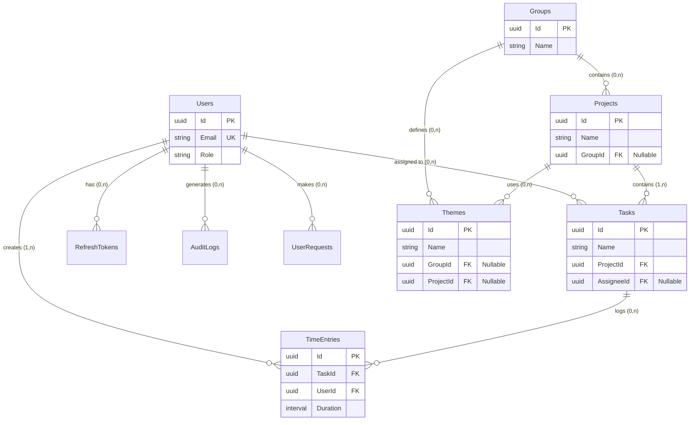
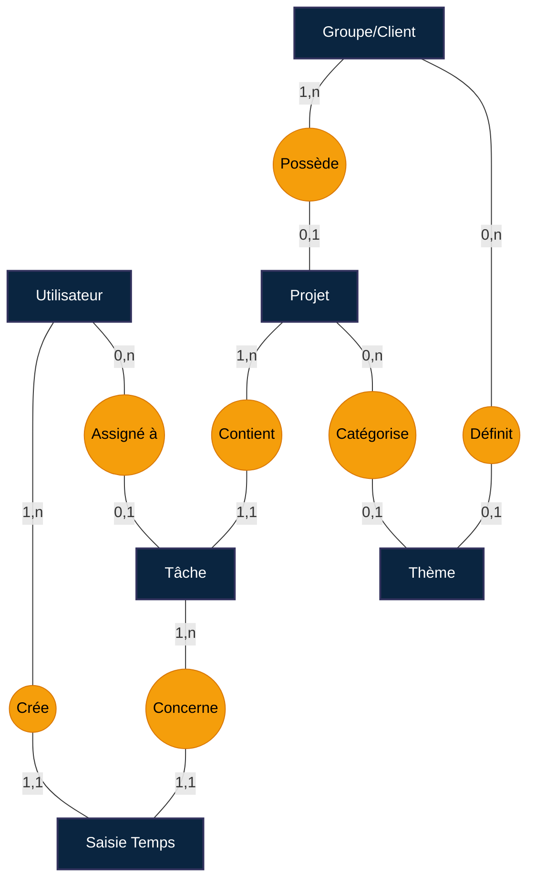

# Schéma de Base de Données TimeScope

Ce document détaille la structure de la base de données PostgreSQL utilisée par TimeScope.

## Modèle Physique de Données (MPD)

*Ce diagramme représente la structure exacte des tables et des clés étrangères.*

> **Note :** Ce diagramme est généré dynamiquement. Si vous voyez du code, utilisez un visualiseur Markdown compatible Mermaid (ex: GitHub, VSCode, GitLab).

## Modèle Conceptuel de Données (MCD)

*Vue logique des entités et de leurs relations (Notation Merise).*

## Tables Détaillées

### 1. Administration & Sécurité

#### `Users`
Stocke les informations des utilisateurs de l'application.

| Colonne | Type | Contraintes | Description |
| :--- | :--- | :--- | :--- |
| `Id` | UUID | **PK** | Identifiant unique |
| `Email` | VARCHAR(255) | **UK**, NOT NULL | Adresse email (login) |
| `PasswordHash` | TEXT | NOT NULL | Hash du mot de passe |
| `FirstName` | VARCHAR(100) | NOT NULL | Prénom |
| `LastName` | VARCHAR(100) | NOT NULL | Nom |
| `Role` | VARCHAR | NOT NULL | Rôle (Admin, User, Manager) |
| `IsActive` | BOOLEAN | NOT NULL | Compte actif ou non |
| `JobTitle` | VARCHAR(100) | NULL | Intitulé du poste |
| `Department` | VARCHAR(100) | NULL | Département |
| `HireDate` | TIMESTAMP | NULL | Date d'embauche |
| `PhoneNumber` | VARCHAR(20) | NULL | Numéro de téléphone |

#### `RefreshTokens`
Gère les jetons de rafraîchissement pour l'authentification JWT.

| Colonne | Type | Contraintes | Description |
| :--- | :--- | :--- | :--- |
| `Id` | UUID | **PK** | Identifiant unique |
| `Token` | VARCHAR(500) | **UK**, NOT NULL | Le jeton de rafraîchissement |
| `UserId` | UUID | **FK** (`Users`), NOT NULL | Utilisateur associé |
| `ExpiresAt` | TIMESTAMP | NOT NULL | Date d'expiration |
| `RevokedByIp` | VARCHAR(45) | NULL | IP ayant révoqué le token |
| `ReplacedByToken` | VARCHAR(500) | NULL | Token de remplacement (rotation) |

#### `AppSettings`
Configuration globale de l'application.

| Colonne | Type | Contraintes | Description |
| :--- | :--- | :--- | :--- |
| `Id` | UUID | **PK** | Identifiant unique |
| `Key` | VARCHAR(200) | **UK**, NOT NULL | Clé de configuration |
| `Value` | TEXT | NOT NULL | Valeur |
| `Category` | VARCHAR(100) | NOT NULL | Catégorie (ex: Email, General) |
| `DataType` | VARCHAR(50) | NOT NULL | Type de donnée (string, int, bool) |

#### `AuditLogs`
Journal d'audit pour la traçabilité des actions.

| Colonne | Type | Contraintes | Description |
| :--- | :--- | :--- | :--- |
| `Id` | UUID | **PK** | Identifiant unique |
| `Action` | VARCHAR(100) | NOT NULL | Action effectuée (Create, Update, Delete) |
| `EntityType` | VARCHAR(100) | NOT NULL | Entité concernée |
| `UserId` | UUID | NULL | ID de l'utilisateur (si applicable) |
| `UserName` | VARCHAR(255) | NOT NULL | Nom de l'utilisateur |
| `Timestamp` | TIMESTAMP | NOT NULL | Date et heure de l'action |
| `IpAddress` | VARCHAR(45) | NULL | Adresse IP source |

### 2. Gestion de Projet

#### `Groups`
Représente les clients ou les groupes de projets.

| Colonne | Type | Contraintes | Description |
| :--- | :--- | :--- | :--- |
| `Id` | UUID | **PK** | Identifiant unique |
| `Name` | VARCHAR(100) | NOT NULL | Nom du groupe/client |

#### `Projects`
Les projets sur lesquels le temps est imputé.

| Colonne | Type | Contraintes | Description |
| :--- | :--- | :--- | :--- |
| `Id` | UUID | **PK** | Identifiant unique |
| `Name` | VARCHAR(100) | NOT NULL | Nom du projet |
| `GroupId` | UUID | **FK** (`Groups`), NULL | Groupe d'appartenance |

#### `Themes`
Catégorisation transversale des projets (ex: R&D, Maintenance).

| Colonne | Type | Contraintes | Description |
| :--- | :--- | :--- | :--- |
| `Id` | UUID | **PK** | Identifiant unique |
| `Name` | VARCHAR(100) | NOT NULL | Nom du thème |
| `Color` | VARCHAR(7) | NOT NULL | Code couleur Hex (#RRGGBB) |
| `GroupId` | UUID | **FK** (`Groups`), NULL | Groupe associé |
| `ProjectId` | UUID | **FK** (`Projects`), NULL | Projet associé |

### 3. Suivi du Temps

#### `Tasks`
Les tâches spécifiques à accomplir dans un projet.

| Colonne | Type | Contraintes | Description |
| :--- | :--- | :--- | :--- |
| `Id` | UUID | **PK** | Identifiant unique |
| `Name` | VARCHAR(200) | NOT NULL | Nom de la tâche |
| `ProjectId` | UUID | **FK** (`Projects`), NOT NULL | Projet parent |
| `AssigneeId` | UUID | **FK** (`Users`), NULL | Utilisateur assigné |

#### `TimeEntries`
Les saisies de temps effectives.

| Colonne | Type | Contraintes | Description |
| :--- | :--- | :--- | :--- |
| `Id` | UUID | **PK** | Identifiant unique |
| `TaskId` | UUID | **FK** (`Tasks`), NOT NULL | Tâche concernée |
| `UserId` | UUID | **FK** (`Users`), NOT NULL | Utilisateur ayant saisi le temps |
| `Date` | TIMESTAMP | NOT NULL | Date de la saisie |
| `Duration` | INTERVAL | NOT NULL | Durée travaillée |
| `Notes` | TEXT | NULL | Commentaire optionnel |

### 4. Demandes Utilisateurs

#### `UserRequests`
Gestion des demandes (congés, matériel, etc.).

| Colonne | Type | Contraintes | Description |
| :--- | :--- | :--- | :--- |
| `Id` | UUID | **PK** | Identifiant unique |
| `Title` | VARCHAR(500) | NOT NULL | Titre de la demande |
| `RequestType` | VARCHAR(50) | NOT NULL | Type (Leave, Hardware, Access) |
| `Status` | VARCHAR(50) | NOT NULL | État (Pending, Approved, Rejected) |
| `Priority` | VARCHAR(20) | NOT NULL | Priorité (Low, Medium, High) |
| `Email` | VARCHAR(255) | NOT NULL | Email du demandeur |

---
*Légende : **PK** = Primary Key, **FK** = Foreign Key, **UK** = Unique Key*
